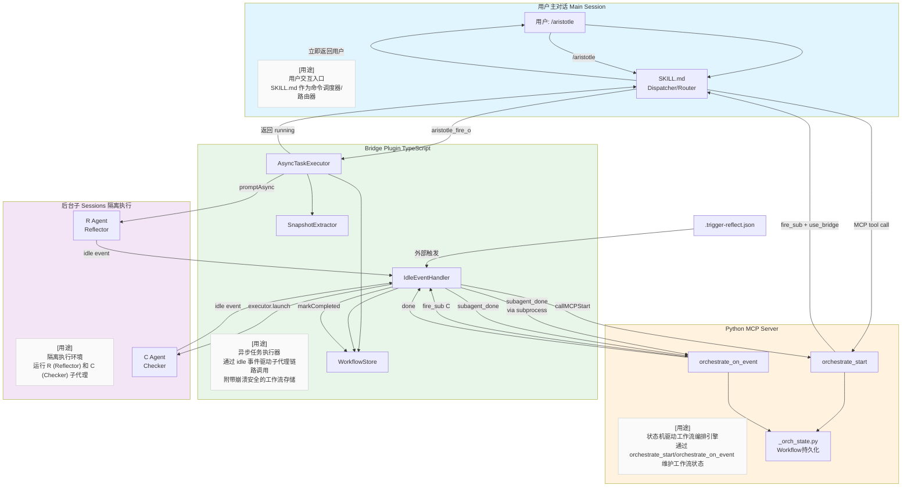
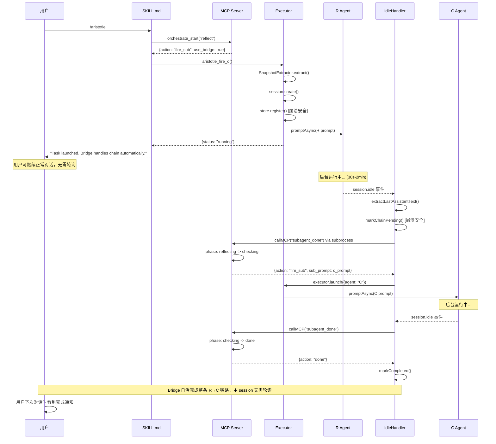
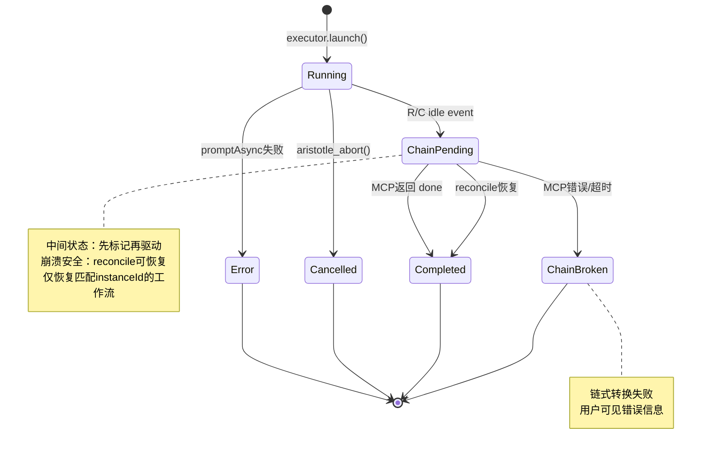
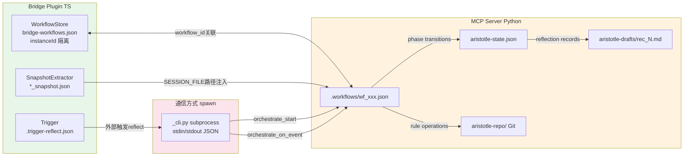

# Aristotle 异步架构图 (Mermaid)

## 整体架构

```mermaid
flowchart TB
    subgraph Main["用户主对话 Main Session"]
        MainPurpose["[用途]\n用户交互入口\nSKILL.md 作为命令调度器/路由器"]
        style MainPurpose fill:#fafafa,stroke:#ccc,stroke-width:1px
        User["用户: /aristotle"]
        SKILL["SKILL.md\nDispatcher/Router"]
        User --> SKILL
    end

    subgraph MCP_Server["Python MCP Server"]
        MCPPurpose["[用途]\n状态机驱动工作流编排引擎\n通过 orchestrate_start/orchestrate_on_event 维护工作流状态"]
        style MCPPurpose fill:#fafafa,stroke:#ccc,stroke-width:1px
        OrchStart["orchestrate_start"]
        OrchEvent["orchestrate_on_event"]
        OrchState["_orch_state.py\nWorkflow持久化"]
        OrchStart --> OrchState
        OrchEvent --> OrchState
    end

    subgraph Bridge["Bridge Plugin TypeScript"]
        BridgePurpose["[用途]\n异步任务执行器\n通过 idle 事件驱动子代理链路调用\n附带崩溃安全的工作流存储"]
        style BridgePurpose fill:#fafafa,stroke:#ccc,stroke-width:1px
        Executor["AsyncTaskExecutor"]
        Idle["IdleEventHandler"]
        Store["WorkflowStore"]
        Snapshot["SnapshotExtractor"]
        Executor --> Store
        Idle --> Store
        Executor --> Snapshot
    end

    subgraph SubSessions["后台子 Sessions 隔离执行"]
        SubPurpose["[用途]\n隔离执行环境\n运行 R (Reflector) 和 C (Checker) 子代理"]
        style SubPurpose fill:#fafafa,stroke:#ccc,stroke-width:1px
        RAgent["R Agent\nReflector"]
        CAgent["C Agent\nChecker"]
    end

    User -->|/aristotle| SKILL
    SKILL -->|MCP tool call| OrchStart
    OrchStart -->|fire_sub + use_bridge| SKILL
    SKILL -->|aristotle_fire_o| Executor
    Executor -->|promptAsync| RAgent
    Executor -->|返回 running| SKILL
    SKILL -->|立即返回用户| User

    RAgent -->|idle event| Idle
    Idle -->|subagent_done\nvia subprocess| OrchEvent
    OrchEvent -->|fire_sub C| Idle
    Idle -->|executor.launch| CAgent
    CAgent -->|idle event| Idle
    Idle -->|subagent_done| OrchEvent
    OrchEvent -->|done| Idle
    Idle -->|markCompleted| Store

    Trigger[".trigger-reflect.json"] -->|外部触发| Idle
    Idle -->|callMCPStart| OrchStart

    style Main fill:#e1f5fe
    style MCP_Server fill:#fff3e0
    style Bridge fill:#e8f5e9
    style SubSessions fill:#f3e5f5
```

## Bridge Path 异步时序图

```mermaid
sequenceDiagram
    participant User as 用户
    participant SKILL as SKILL.md
    participant MCP as MCP Server
    participant Exec as Executor
    participant R as R Agent
    participant Idle as IdleHandler
    participant C as C Agent

    User->>SKILL: /aristotle
    SKILL->>MCP: orchestrate_start("reflect")
    MCP-->>SKILL: {action: "fire_sub", use_bridge: true}
    SKILL->>Exec: aristotle_fire_o()
    Exec->>Exec: SnapshotExtractor.extract()
    Exec->>Exec: session.create()
    Exec->>Exec: store.register() [崩溃安全]
    Exec->>R: promptAsync(R prompt)
    Exec-->>SKILL: {status: "running"}
    SKILL-->>User: "Task launched. Bridge handles chain automatically."
    Note over User: 用户可继续正常对话，无需轮询

    Note over R: 后台运行中... (30s-2min)
    R-->>Idle: session.idle 事件

    Idle->>Idle: extractLastAssistantText()
    Idle->>Idle: markChainPending() [崩溃安全]
    Idle->>MCP: callMCP("subagent_done") via subprocess
    MCP->>MCP: phase: reflecting -> checking
    MCP-->>Idle: {action: "fire_sub", sub_prompt: c_prompt}

    Idle->>Exec: executor.launch({agent: "C"})
    Exec->>C: promptAsync(C prompt)
    Note over C: 后台运行中...

    C-->>Idle: session.idle 事件
    Idle->>MCP: callMCP("subagent_done")
    MCP->>MCP: phase: checking -> done
    MCP-->>Idle: {action: "done"}
    Idle->>Idle: markCompleted()

    Note over Idle,User: Bridge 自治完成整条 R→C 链路，主 session 无需轮询
    User->>User: 用户下次对话时看到完成通知
```

## 状态转换图

```mermaid
stateDiagram-v2
    [*] --> Running: executor.launch()

    Running --> ChainPending: R/C idle event
    Running --> Error: promptAsync失败
    Running --> Cancelled: aristotle_abort()

    ChainPending --> Completed: MCP返回 done
    ChainPending --> ChainBroken: MCP错误/超时
    ChainPending --> Completed: reconcile恢复

    Error --> [*]
    Cancelled --> [*]
    Completed --> [*]
    ChainBroken --> [*]

    note right of ChainPending
        中间状态：先标记再驱动
        崩溃安全：reconcile可恢复
        仅恢复匹配instanceId的工作流
    end note

    note right of ChainBroken
        链式转换失败
        用户可见错误信息
    end note
```

## 数据流架构

```mermaid
graph LR
    subgraph TypeScript["Bridge Plugin TS"]
        WS["WorkflowStore\nbridge-workflows.json\ninstanceId 隔离"]
        SS["SnapshotExtractor\n*_snapshot.json"]
        TR["Trigger\n.trigger-reflect.json"]
    end

    subgraph Python["MCP Server Python"]
        WF[".workflows/wf_xxx.json"]
        STATE["aristotle-state.json"]
        DRAFT["aristotle-drafts/rec_N.md"]
        REPO["aristotle-repo/ Git"]
    end

    subgraph Communication["通信方式 spawn"]
        CLI["_cli.py subprocess\nstdin/stdout JSON"]
    end

    WS <-->|workflow_id关联| WF
    SS -->|SESSION_FILE路径注入| WF
    TR -->|外部触发reflect| CLI
    CLI -->|orchestrate_start| WF
    CLI -->|orchestrate_on_event| WF
    WF -->|phase transitions| STATE
    STATE -->|reflection records| DRAFT
    WF -->|rule operations| REPO

    style TypeScript fill:#e8f5e9
    style Python fill:#fff3e0
    style Communication fill:#fce4ec
```
